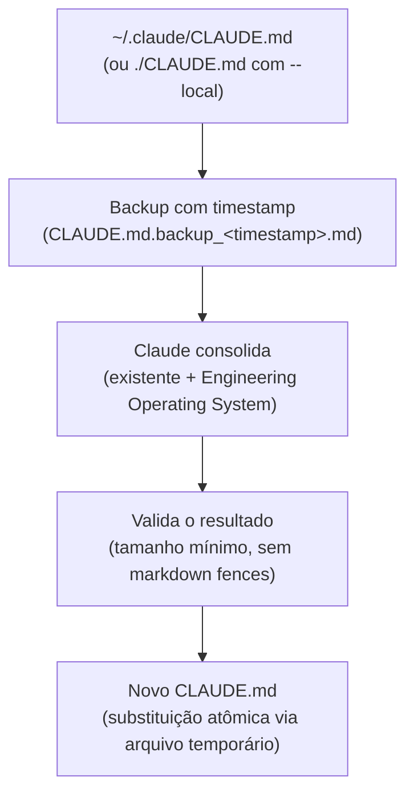
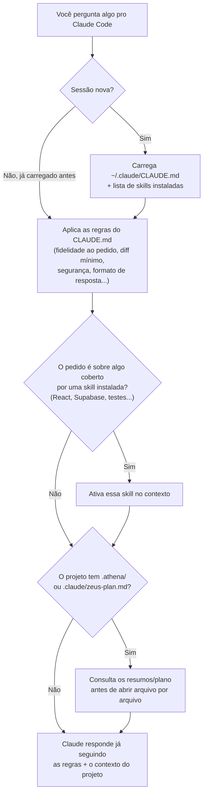

# Thero


**Configura seu [Claude Code](https://claude.com/claude-code) como se
um time sênior tivesse revisado antes de você abrir o terminal.**

Você abre o Claude Code num projeto novo e ele começa do zero: não
conhece suas convenções, não sabe se pode reescrever código que já
funciona, não avisa antes de uma ação arriscada. Toda sessão você
reexplica as mesmas regras. O `thero` resolve isso de vez: roda um
comando, e toda sessão futura do Claude Code — nesse computador ou
nesse projeto — já nasce sabendo como você trabalha.

Não precisa ser sênior pra usar. Se você está começando a programar e
quer que o Claude Code te ajude com um padrão de qualidade real (em
vez de só "fazer funcionar"), é exatamente pra isso que o `thero`
existe — ele importa, pra dentro do seu projeto, o jeito de trabalhar
de quem já bateu a cabeça com isso.

## Por que usar

- **Você para de reexplicar o óbvio.** Regras como "não reescreva
  código que já funciona sem necessidade", "avise antes de ações
  destrutivas", "termine com um resumo do que mudou" passam a valer
  desde a primeira mensagem, em qualquer projeto.
- **Conhecimento especializado sob demanda.** React, Supabase,
  TypeScript, testes — instalados como Agent Skills, que só entram no
  contexto quando a tarefa realmente precisa (sem inflar toda
  conversa com informação irrelevante).
- **Zero dependências, zero risco.** Só Python (que você já tem se
  programa) e o próprio Claude Code. Nunca apaga nada seu — sempre
  faz backup antes de qualquer mudança.
- **Parte de uma suíte**: o [Athena](https://github.com/theroverse/athena)
  indexa a arquitetura do seu projeto pra o Claude não precisar reler
  tudo do zero, e o [Zeus](https://github.com/theroverse/zeus) planeja
  uma tarefa antes de você pedir pro Claude executar. Os três se
  integram (veja [Athena e Zeus](#athena-e-zeus) abaixo), mas cada um
  funciona sozinho.

## O que ele faz

O `thero.py` automatiza a configuração do Claude Code para um fluxo de
engenharia de software profissional. Ele:

- instala Agent Skills relevantes (React/Frontend, Supabase, Stripe,
  Firebase, TypeScript, testes, etc.);
- preserva skills já instaladas (`caveman`, `impeccable`);
- preserva o `CLAUDE.md` existente;
- cria backup antes de qualquer alteração;
- usa o próprio Claude Code para consolidar o `CLAUDE.md`, mesclando as
  instruções existentes com um novo "Engineering Operating System" enxuto;
- separa comportamento global (CLAUDE.md) de conhecimento especializado
  (Agent Skills), para manter o CLAUDE.md pequeno e eficiente em tokens;
- permite auditar um projeto (modo somente leitura) antes de qualquer
  alteração de código;
- pode operar globalmente (usuário, `~/.claude`) ou localmente (projeto
  atual, `--local`);
- instala um comando de atalho (PowerShell no Windows; bash/zsh no
  macOS/Linux), global ou local ao projeto, para rodar o script de
  qualquer lugar;
- favorece mudanças pequenas e verificáveis.

## Requisitos

- Python 3.10+ (só biblioteca padrão, sem dependências externas)
- Node.js e `npx` (necessários para instalar skills via `npx skills add`)
- Claude Code instalado e autenticado (necessário para consolidar o
  `CLAUDE.md` e para rodar auditorias — `claude -p`)
- Comando de atalho (`--install-command`): Windows (PowerShell) ou
  macOS/Linux (bash/zsh, detectado via `$SHELL`); suporte
  macOS/Linux é novo, validado via Git Bash no Windows, zsh/bash
  reais ainda não testados

Se `claude` não estiver disponível, a instalação de skills ainda funciona;
apenas a consolidação do `CLAUDE.md` e a auditoria são puladas (com aviso).

## Instalação

Não há instalação via `pip`. Basta clonar e rodar:

```
git clone https://github.com/theroverse/thero.git
cd thero
python thero.py
```

## Uso

```
python thero.py [opções]
```

## Comandos

| Comando                    | O que faz                                                          |
|-----------------------------|---------------------------------------------------------------------|
| *(sem argumentos)*          | Fluxo completo: instala skills, consolida o `CLAUDE.md` e instala/atualiza o comando `thero` (global). |
| `--skills-only`             | Instala apenas as skills, sem tocar no `CLAUDE.md` nem no comando. |
| `--merge-only`               | Consolida apenas o `CLAUDE.md` (requer `claude`).                  |
| `--audit-only`               | Audita o projeto atual (somente leitura), sem instalar nada.       |
| `--audit`                    | Executa o fluxo completo e, em seguida, audita o projeto atual.    |
| `--install-command [NOME]`   | Instala/atualiza somente o comando de atalho (padrão: `thero`). Sem `NOME`, pergunta interativamente (Enter aceita o sugerido). |
| `--index`                    | Roda a [Athena](https://github.com/theroverse/athena) na pasta atual (indexa a arquitetura em `.athena/`); instala/atualiza automaticamente via git se preciso e o terminal for interativo. |
| `--plan TAREFA`              | Roda o [Zeus](https://github.com/theroverse/zeus) na pasta atual para planejar `TAREFA` (escreve `.claude/zeus-plan.md`); instala/atualiza automaticamente via git, mesmo mecanismo do `--index`. |
| `--check`                    | Verifica se alguma skill instalada tem atualização disponível (`npx skills check` + `npx impeccable check`). |
| `--update`                   | Atualiza as skills instaladas para a versão mais recente (`npx skills update` + `npx impeccable update`). |
| `--local`                    | Faz tudo (`CLAUDE.md`, skills, comando) mirar a pasta do projeto atual em vez do usuário global. Combina com qualquer outra flag. |
| `-h`, `--help`               | Mostra a ajuda e sai, sem instalar nada, sem modificar arquivos e sem chamar o Claude. |

## Exemplos

Instalar e configurar tudo (skills + CLAUDE.md + comando `thero`):

```
python thero.py
```

Instalar tudo na pasta do projeto atual (CLAUDE.md, skills e comando
ficam locais ao projeto, não no usuário global):

```
python thero.py --local
```

Instalar somente as skills:

```
python thero.py --skills-only
```

Consolidar somente o `CLAUDE.md`:

```
python thero.py --merge-only
```

Auditar o projeto atual sem modificar código:

```
python thero.py --audit-only
```

Instalar/configurar e, na sequência, auditar o projeto atual:

```
python thero.py --audit
```

Instalar só o comando de atalho (pergunta o nome, Enter aceita `thero`):

```
python thero.py --install-command
```

Instalar o comando de atalho com nome customizado, sem perguntar:

```
python thero.py --install-command meunome
```

Instalar o comando de atalho restrito à pasta do projeto atual (não mexe
no `$PROFILE` global):

```
python thero.py --install-command --local
```

Indexar a arquitetura do projeto atual com a Athena (se instalada):

```
python thero.py --index
```

Ver se alguma skill tem atualização, e atualizar:

```
python thero.py --check
python thero.py --update
```

Ver a ajuda (não instala nada, não modifica nada, não chama o Claude):

```
python thero.py --help
python thero.py -h
```

## Fluxo recomendado

1. Rode `python thero.py` (ou `--skills-only` seguido de `--merge-only`,
   se preferir controlar as etapas separadamente).
2. Reinicie o Claude Code e o PowerShell (ou `. $PROFILE`) para carregar
   as skills, o `CLAUDE.md` e o comando `thero`.
3. Ao trabalhar em um projeto específico, rode `thero audit-only`
   (ou `python thero.py --audit-only`) dentro do projeto para gerar
   `CLAUDE_AUDIT.md` (somente leitura, nada é alterado).
4. Leia o `CLAUDE_AUDIT.md`.
5. Corrija primeiro os achados `CRITICAL`, depois `BUG`, depois `RISK`.
6. Rode novamente typecheck/lint/testes.
7. Revise o `git diff`.
8. Só então considere itens de `MAINTENANCE`.
9. Trate itens de `IMPROVEMENT` como opcionais.

Um prompt útil para a etapa de correção, usado com o próprio Claude Code:

```
Read CLAUDE_AUDIT.md and correct the CRITICAL, BUG and RISK
findings that are supported by the current code. Do not perform
unrelated refactors. Verify every correction.
```

## Como plugin (Claude Code e Codex)

O repositório também é um plugin. Ele expõe 4 skills que chamam o
`thero.py` a partir da pasta do projeto atual: `thero`
(`skills|merge|check|update`), `thero-audit`, `thero-index` e
`thero-plan`. Todas só rodam quando você as invoca.

**Claude Code** (`/thero:thero`, `/thero:thero-audit`, ...):

```
claude plugin marketplace add theroverse/thero
claude plugin install thero@thero
```

**Codex** (skills `thero`, `thero-audit`, ...):

```
codex plugin marketplace add theroverse/thero
codex plugin add thero@thero
```

Para testar uma cópia local, troque `theroverse/thero` pelo caminho da
pasta. Reinicie a sessão (ou recarregue a janela do VSCode) depois de
instalar. O plugin não instala o comando `thero` no shell nem as skills
externas: rode `thero` uma vez no seu terminal para isso.

## Comando de atalho (PowerShell)

O `thero` instala um comando de atalho (`thero` por padrão) que roda o
script a partir de qualquer pasta, usando a pasta atual como alvo
(equivalente a rodar `python thero.py --audit` etc. de dentro daquele
projeto).

**Global** (padrão, sem `--local`): cria/atualiza uma função no seu
`$PROFILE` do PowerShell (Windows) ou em `~/.zshrc` / `~/.bashrc` /
`~/.profile` (macOS/Linux, detectado via `$SHELL`). Funciona em
qualquer pasta, em qualquer sessão, depois de recarregar o terminal
(`. $PROFILE` / `source ~/.zshrc` ou abrir um novo).

```
thero              -> thero.py (instala tudo)
thero skills       -> --skills-only
thero merge        -> --merge-only
thero audit        -> --audit
thero audit-only   -> --audit-only
thero index        -> --index
thero check        -> --check
thero update       -> --update
thero help         -> --help
thero -h           -> repassado cru (qualquer flag não mapeada)
```

**Local** (`--install-command --local`): cria `<nome>.local.ps1`
(Windows) ou `<nome>.local.sh` (macOS/Linux) na pasta do projeto
atual, em vez de mexer no perfil global. Carregue na sessão com
`. .\thero.local.ps1` ou `source ./thero.local.sh`. A função só
executa se o diretório atual for aquele projeto (ou uma subpasta
dele); fora dali, recusa com erro. Cada chamada já roda o script com
`--local` (skills e CLAUDE.md também ficam locais ao projeto).

Rodar a instalação de novo (global ou local) atualiza a função existente
— não duplica, mesmo trocando de nome.

## Athena e Zeus

O `thero` pode se integrar com a [Athena](https://github.com/theroverse/athena)
(indexador recursivo de arquitetura via Claude Code) como parte do
fluxo de trabalho, não só como instalação:

- `thero --index` (ou `thero index`) roda `athena index .` na pasta
  atual. Ele procura a Athena numa pasta irmã `athena/` (layout padrão
  do monorepo `myscripts`) ou no caminho apontado pela variável de
  ambiente `THERO_ATHENA_PATH`; se não achar em nenhum dos dois, e o
  terminal for interativo, oferece clonar automaticamente
  (`git clone`) numa cópia gerenciada em `~/.thero/tools/athena` — e,
  se essa cópia já existir mas estiver desatualizada em relação ao
  remoto, oferece atualizá-la (`git pull`) antes de rodar. Requer
  `git` instalado; em sessão não interativa (ex.: agente de IA), pula
  o clone/update automático em vez de travar esperando confirmação.
- O `CLAUDE.md` que o `thero` gera/consolida já instrui o Claude a
  checar `.athena/summary.atn.md` e `.athena/tree/**` antes de explorar um
  projeto desconhecido, usando os resumos como primeira fonte de
  contexto em vez de reler cada arquivo do zero (cai de volta pro
  arquivo real quando o resumo não é suficiente).

[**Zeus**](https://github.com/theroverse/zeus) — um planejador que
cruza o pedido do usuário com o índice da Athena (via `claude -p`)
para decidir quais arquivos importam para uma tarefa — pode rodar
tanto standalone (`python zeus.py plan "<tarefa>" [pasta]`) quanto
via `thero --plan "<tarefa>"`, na pasta atual. `--plan` localiza o
Zeus exatamente como `--index` localiza a Athena: variável de
ambiente `THERO_ZEUS_PATH` → pasta irmã `zeus/` (layout do monorepo
`myscripts`) → cópia gerenciada em `~/.thero/tools/zeus`, clonada ou
atualizada automaticamente via `git`, com confirmação, se não achar
nos dois primeiros lugares. `thero --plan` já roda `athena index`
sozinho antes de planejar (o Zeus faz isso), então não precisa rodar
`thero --index` antes. O `CLAUDE.md` gerado pelo `thero` já reconhece
o `.claude/zeus-plan.md` resultante como ponto de partida de contexto
(formato: seções fixas Objetivo / Arquivos selecionados / Passo a
passo / Riscos) — não é obrigatório rodar o Zeus para usar o `thero`.

## Skills

As skills são instaladas individualmente (uma chamada `npx skills add`
por skill), para que a falta ou renomeação de uma skill não interrompa a
instalação das demais. Sem `--local`, instalam em `~/.claude/skills`
(`--global` no `npx skills add`); com `--local`, instalam em
`./.claude/skills` do projeto (sem `--global`). `impeccable` usa seu
próprio instalador (`npx impeccable install -y --force --providers=claude`,
sem prompts), fora desse mecanismo genérico. `--check`/`--update`
cobrem os dois mecanismos (`npx skills` e `impeccable`).

Ao final da instalação, o script gera automaticamente
`SKILLS_INSTALL_FAILED.md` — na pasta deste script (modo global) ou na
pasta do projeto (modo `--local`) — listando cada skill que falhou
(grupo, repositório, nome da skill e o comando `npx` usado). Se tudo
instalar com sucesso, esse arquivo é removido/não é criado. Envie o
conteúdo desse arquivo para o Claude corrigir os nomes de skills ou
repositórios desatualizados.

Grupos de skills instalados a partir de repositórios externos:

- **Engineering / Reasoning** (`darasoba/agent-skills`):
  `fable-reasoning`, `engineering-manager`
- **Supabase** (`supabase/agent-skills`):
  `supabase`, `supabase-postgres-best-practices`
- **React / Frontend** (`PyModel/react-frontend-skills`):
  `react`, `react-hooks`, `nextjs`, `typescript`, `tailwind`,
  `shadcn`, `ui-design`, `accessibility`, `performance`,
  `feature-architecture`, `vercel-react-best-practices`,
  `react-hook-form`, `zod`, `tanstack-query`, `vitest`, `playwright`,
  `msw`, `tdd`
- **Agents Inc** (`agents-inc/skills`):
  `typescript`, `react`, `nextjs`, `python`, `firebase`, `stripe`,
  `supabase`, `tailwind`, `mui`, `testing`, `security`,
  `code-review`, `performance`, `accessibility`
- **Caveman** (`JuliusBrussee/caveman`): `caveman`

Instalada à parte (não usa `npx skills add`):

- **impeccable** — `npx impeccable install`

## CLAUDE.md

O script nunca apaga o `CLAUDE.md` existente — `~/.claude/CLAUDE.md` por
padrão, ou `./CLAUDE.md` (na pasta do projeto) com `--local`. O fluxo de
consolidação é:



Se o `CLAUDE.md` alvo ainda não existir, ele é criado diretamente a
partir do "Engineering Operating System" padrão, sem chamar o Claude.

Se a consolidação falhar (Claude indisponível, erro na chamada, saída
vazia ou validação reprovada), o arquivo original **permanece intacto**
e um aviso é impresso.

## O que muda no Claude depois de instalar

Rodar o `thero` não é "instalar um programa" — é escrever dois tipos
de arquivo que o Claude Code já sabe ler sozinho: `CLAUDE.md`
(comportamento) e Agent Skills (conhecimento especializado). O
`thero` termina, mas o efeito só aparece na **próxima sessão** do
Claude Code (por isso ele sempre lembra "reinicie o Claude Code").



Na prática, isso significa que **antes mesmo de você digitar
qualquer coisa**, uma sessão nova do Claude Code já carregou:

1. **As regras do `CLAUDE.md`** — fidelidade ao pedido, diff mínimo,
   segurança, formato de resposta final, etc. (as 21 regras do
   "Engineering Operating System" que o `thero` escreve).
2. **A lista de Agent Skills instaladas** — conhecimento
   especializado (React, Supabase, Stripe, TypeScript...) que só é
   ativado quando a tarefa pede aquele assunto, para não inflar o
   contexto à toa.

Dois efeitos são visíveis **desde a primeira mensagem** da sessão,
sem você precisar pedir nada:

- **Respostas comprimidas por padrão** (regra ##21, "Caveman"): se a
  skill `caveman` foi instalada, o Claude já responde no estilo
  terse/comprimido desde o "oi" inicial — não é preciso digitar
  `/caveman` ou pedir "seja breve". Se a resposta vier longa e
  formal desde o início, é sinal de que o `CLAUDE.md` não foi escrito
  ou não foi carregado (reinicie o Claude Code na pasta certa).
- **Contexto de arquitetura, se existir** (regra ##20): se o projeto
  já tem `.athena/summary.atn.md` (gerado por `thero --index`, o
  [Athena](https://github.com/theroverse/athena)) ou
  `.claude/zeus-plan.md` (gerado por `thero --plan "<tarefa>"`, o
  [Zeus](https://github.com/theroverse/zeus)), o Claude consulta
  esses resumos antes de abrir arquivo por arquivo — mais rápido,
  sem precisar reindexar do zero a cada pergunta.

Como confirmar isso "na prática", numa sessão nova:

```
1. cd no projeto onde o thero rodou (ou abra um terminal novo, se foi --global)
2. Pergunte: "quais skills você tem disponíveis agora?"
   -> deve listar as skills instaladas pelo thero (Supabase, React, Caveman, ...)
3. Observe a PRIMEIRA resposta da sessão
   -> deve já vir comprimida/terse, sem você pedir "seja breve"
4. Se o projeto tiver .athena/ ou .claude/zeus-plan.md, peça algo que
   exija explorar o código
   -> a resposta deve citar os resumos em vez de reabrir cada arquivo
```

Se nenhum desses sinais aparecer, o `CLAUDE.md`/as skills não foram
carregados nessa sessão — confira se o `thero` rodou na pasta certa
(`--local` vs global) e se você de fato abriu uma sessão **nova**
depois (sessões já abertas antes de rodar o `thero` não recarregam
sozinhas).

## Estrutura do projeto

```
thero/
├── thero.py                 # ponto de entrada (python thero.py ...)
├── src/thero/
│   ├── cli.py                # argparse + orquestração (main)
│   ├── settings.py           # paths e constantes globais
│   ├── domain/                # conteúdo/conhecimento (Engineering System)
│   ├── skills/                 # catálogo + instalador de Agent Skills
│   ├── claude_md/               # cliente `claude -p` + merge do CLAUDE.md
│   ├── audit/                    # auditoria de projeto (read-only)
│   ├── shell_command/             # comando de atalho (PowerShell + bash/zsh, global/local)
│   ├── integrations/               # ponte com ferramentas externas (Athena)
│   └── system/                      # processo, backup, ambiente
├── README.md
└── .gitignore
```

Cada pasta representa um contexto isolado (skills, CLAUDE.md, auditoria,
comando de atalho, infraestrutura de sistema), para facilitar manutenção
e crescimento sem acoplar regras de negócio diferentes no mesmo arquivo.

## Known issues

- Comando de atalho (`--install-command`) no macOS/Linux é novo:
  validado via Git Bash no Windows (`bash -n` e execução real da
  função gerada), mas zsh/bash reais em macOS/Linux ainda não foram
  testados.
- Os catálogos `darasoba/agent-skills` e `supabase/agent-skills`
  nunca apareceram em falhas de instalação em testes reais, mas não
  foram verificados isoladamente skill por skill (baixa prioridade).
  Se alguma skill nova sumir/for renomeada no repositório, ela
  aparece em `SKILLS_INSTALL_FAILED.md` sem interromper as demais.

## Troubleshooting

**`[ERROR] node was not found`**
Instale o Node.js e garanta que `node` esteja no `PATH`.

**`[ERROR] npx was not found`**
Instale o Node.js (o `npx` normalmente já vem junto) e garanta que esteja
no `PATH`.

**`[WARN] claude was not found. Skill installation may still work.`**
A instalação de skills não depende do Claude Code. Esse aviso aparece no
fluxo padrão e em `--skills-only`; a consolidação do `CLAUDE.md` será
pulada até o Claude Code estar instalado e autenticado.

**`[ERROR] claude was not found` (com `--merge-only` ou `--audit-only`)**
Esses comandos exigem o Claude Code instalado e autenticado. Instale com
`npm install -g @anthropic-ai/claude-code` (ou o método oficial mais
recente) e rode `claude` uma vez para autenticar.

**`[WARN] Could not install <skill> from <repo>`**
A skill pode ter sido renomeada ou removida do repositório. As demais
skills continuam sendo instaladas normalmente; nenhuma ação manual é
necessária a menos que você precise especificamente dessa skill.

**`[ERROR] Claude returned an error.` / `[ERROR] Claude returned empty output.`**
Rode `claude -p "hello"` manualmente para confirmar que o CLI funciona e
está autenticado. Verifique conectividade e limites de uso.

**`[ERROR] Generated CLAUDE.md is suspiciously small.` / `... contains unexpected markdown fences.`**
A consolidação foi rejeitada por segurança. O `CLAUDE.md` original não
foi alterado. Rode `--merge-only` novamente; se persistir, revise
manualmente com `claude -p` fora do script.

**`[ERROR] Could not replace CLAUDE.md: ...`**
Falha ao substituir o arquivo (por exemplo, permissão de arquivo). O
`CLAUDE.md` original é preservado; verifique permissões em `~/.claude/`.

**`[ERROR] Could not resolve the PowerShell $PROFILE path`**
Só ocorre no Windows; rode o script em um PowerShell normal, não dentro
de outro shell ou ambiente restrito.

**`'thero' e um comando local do projeto '...'`**
Você tentou usar um comando instalado com `--install-command --local`
fora da pasta do projeto (ou de uma subpasta dela). Volte para essa
pasta, ou instale o comando global (sem `--local`) se quiser usá-lo de
qualquer lugar.

**Onde ficam os backups?**
Ao lado do arquivo original, com sufixo `.backup_<AAAAMMDD_HHMMSS>`
(ex.: `CLAUDE.md.backup_20260101_120000.md`). Nada é apagado
automaticamente.

**`--help` / `-h` não faz nada além de mostrar texto?**
Correto — por design, `--help`/`-h` nunca instala skills, nunca modifica
arquivos e nunca chama o Claude. É seguro rodar mesmo em uma máquina sem
Node.js ou Claude Code configurados.

## Autor

**Anthero Vieira Neto**

- E-mail: antherovn@gmail.com
- LinkedIn: https://www.linkedin.com/in/anthero-vieira-neto-aa7a6b8a
- GitHub: http://github.com/netovieira

## Licença

[MIT](./LICENSE)
